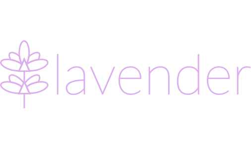

# Lavender 

A simple configurable slideshow program for DOS 2.0+ and Windows 2000+ written mainly in C. It shows slides consisting of text and graphics contained in the ZIP file appended to the executable.

This is still work in progress, but I'm doing my best to separate working version (`main` branch) from progressing code (PRs).



## Current features
* DOS, Windows, and diagnostic Linux targets
* [text-based script file format](docs/slides.md)
* graphics mode
  * CGA 640x200 monochrome under DOS
  * EGA 640x350 16-color under DOS using a loadable driver
  * 24-bit RGB under Windows and Linux with user-customizable content size
  * Windows DPI awareness and full screen mode support
* display delays (animations)
  * millisecond resolution
* displaying text (with UTF-8 subset support)
  * under DOS, supports Czech, Polish, and Spanish diacritics, and 0x00-0x1F, 0x7F CP437 special characters
* displaying bitmap images
  * monochrome binary Portable BitMap (P4) files
  * 16-color Windows Device Independent Bitmaps (BMP)
  * XRGB8888 Windows Device Independent Bitmaps (BMP) under Windows and Linux
* drawing and filling rectangles
  * 16 colors on Windows, Linux, and DOS with EGA
  * mapped 5 monochrome patterns on DOS with CGA
* MIDI Type 0 and [own mono format](docs/spk.md) music playback
  * PC Speaker (with 3 simulated voices), Yamaha OPL2, Roland MPU-401 UART under DOS, with loadable driver support
  * Windows MME API
  * FluidSynth under Linux
* script nesting
  * plain text, or encrypted using XOR or DES
* navigation and user input using key presses and mouse clicks
* multiple language support (Czech, English, Polish)

## Building
Building requires x86_64 Linux with *CMake*, *GNU Make*, *GNU Binutils*, and `zip`.
Windows target is built using [LLVM-MinGW](https://github.com/mstorsjo/llvm-mingw) for i686, x86_64, armv7, and aarch64, but can be built using Visual C++.
Linux builds relies on *SDL2* and *SDL2_ttf* libraries, also requiring Fontconfig, FluidSynth, and libblkid.
MS-DOS builds require [GCC for IA-16](https://github.com/tkchia/gcc-ia16/) with [libi86](https://github.com/tkchia/libi86/).
Script encryption tools are written in *Python 3*.

If you have it all, you can configure the environment:
```sh
# Native (diagnostic) Linux build, either GCC or Clang is fine
cmake -S . -B build

# MS-DOS build, COM file (DOS 2+)
cmake -S . -B build -DCMAKE_TOOLCHAIN_FILE=cmake/DOS-GCC-IA16.cmake -DDOS_TARGET_COM=1

# MS-DOS build, EXE file (DOS 3+)
cmake -S . -B build -DCMAKE_TOOLCHAIN_FILE=cmake/DOS-GCC-IA16.cmake

# Windows build, IA-32 (Windows 2000+)
CC=i686-w64-mingw32-gcc cmake -S . -B build -DCMAKE_SYSTEM_NAME=Windows

# Windows build, x64 (Windows XP+)
CC=x86_64-w64-mingw32-gcc cmake -S . -B build -DCMAKE_SYSTEM_NAME=Windows
```

You can select user interface language (`ENU`, `CSY`, `PLK`) by adding the `-DLAV_LANG=` option.

After finishing configuration, navigate to the `build` directory and run `make bundle`. An executable called `sshow` should appear. You can modify the slideshow by editing files in the `data` directory.
