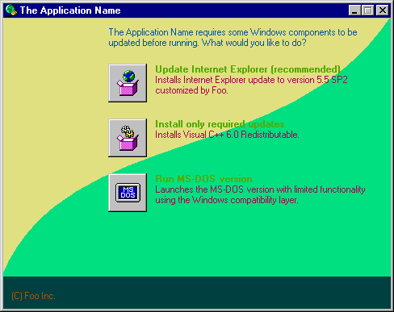

# Lavender AutoRun Dependency (LARD) Checker

A configurable and localizable AutoRun application for checking Lavender run-time dependecies.
This utility is able to verify the processor level, version of the operating system, installed service pack, Internet Explorer, and dynamically linked libraries (DLLs).
LARD runs on Windows NT 3.1 and above, and Windows 95 and above, on any IA-32 processor, without any additional dependencies.

If all defined requirements are met, the utility doesn't show any user interface and automatically launches the application.

If the minimum processor level, operating system or service pack version is not met, or required DLLs are unavailable and the configuration file doesn't define applicable sources, the utility shows a message box, offering the DOS version if possible.

If one or more DLLs needs to be updated, and the configuration file defines applicable sources, the utility shows a selection window that offers installation of updates or (optionally) Internet Explorer, or launching the DOS version:



Customization files (`lard.ini` configuration file, `icon.ico` window icon, `bg.bmp` and `bg16.bmp` window backgrounds) are stored in the same directory as the `lard.exe` program.

## Configuration file
Requirements and string customizations are specified in the `lard.ini` configuration file.
Configuration can be localized, where locale-specific instance of configuration file is placed in a subdirectory named with the applicable LCID (e.g. `0409\lard.ini` for US English).
If some setting is not defined for a particular language, the utility falls back to the global `lard.ini`.


```ini
[lard]
name         = The Application Name   ; used in title and messages, defaults to Lavender
run          = path\to\ia32\sshow.exe ; defaults to ia32\sshow.exe
rundos       = path\to\dos\sshow.exe  ; optional
copyright    = (C) 2025 Foo Inc.      ; defaults to the Lavender copyright

[colors] ; text colors, default to white 
intro        = #0055AA ; introduction
title        = #55AA00 ; option title
text         = #AA0055 ; option text
footer       = #AA5500 ; copyright footer

[system] ; minimum requirements
cpu          = i486  ; processor level - i386, i486 (default), p5, p6, sse, sse2, x64
win          = x.y   ; version of Windows 9x, defaults to 4.0
winnt        = x.y   ; version of Windows NT, defaults to 4.0
; winsp(nt)x.y = a.b ; optionally, service pack versions:
winsp4.0     = 2.5   ; Windows 95 OEM Service Release
winsp4.10    = 1.0   ; Windows 98 edition (1.0 - Second Edition)
winspnt4.0   = 3.0   ; Windows NT 4.0 Service Pack
winspnt5.1   = 2.0   ; Windows XP Service Pack
                     ; etc.

[ie] ; optional details about Internet Explorer
     ; version numbers before 5.0 refer to the URL.DLL version
     ; e.g. IE 3.02 - version 4.70.1300
complete     = 5.0       ; minimum version of IE that delivers all dependencies
                         ; this suppresses all other checks, except the processor level
offer        = 5.50.4807 ; optional, version number of the offered IE installation
description  = 5.5 SP2 customized by Foo
install      = path\to\iesetup.exe

[dependencies] ; minimum DLL versions, non-localizable
comctl32.dll = 5.80, comupd, vcrt ; offered by two sources
msvcrt.dll   = 4.20, vcrt         ; offered by one source
wininet.dll  = 4.70               ; required but not offered

; [source.*] ; offered sources for installable DLLs

[source.comupd]
description  = Common Controls 5.80 Update
path         = path\to\50comupd.exe

[source.vcrt]
description  = Visual C++ 6.0 Redistributable
path         = path\to\vcredist.exe
```
